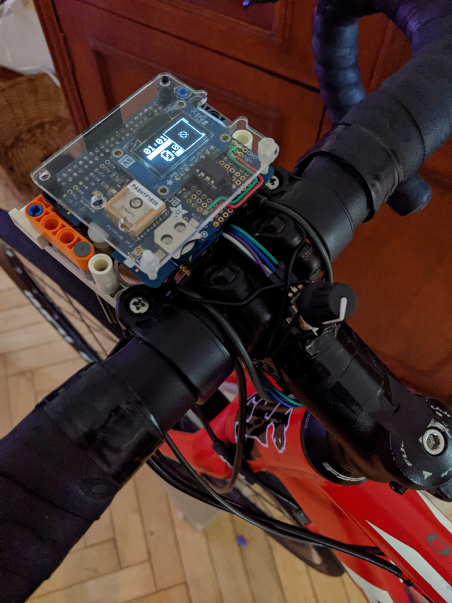
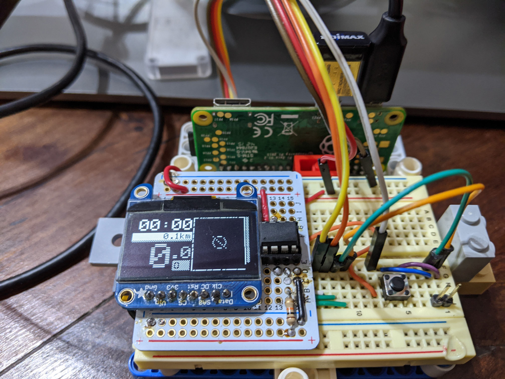
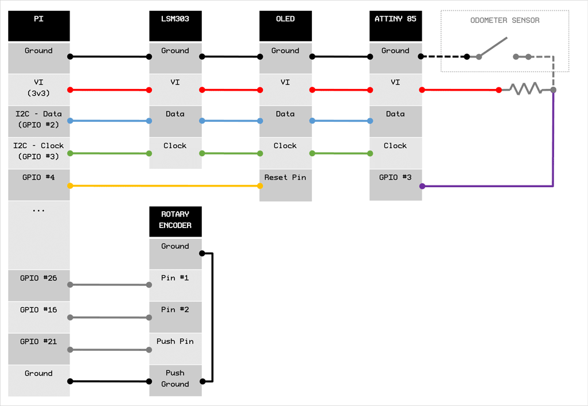

# BLU-PI CYCLING COMPUTER

GPS Cycling Computer |  Raspberry Pi + GPS + ATTiny Odometer | Node.JS

| Overview | Intervals | Sys. Averages | Map | Menu | 
| -------- | --------- | ------------- | --- | ---- | 
|  |  |  |  |  |

| Setup | Cockpit | Prototype |
| ----- | ------- | --------- |
|  |  |  |


## Install & Running

Install dependencies:

$ `npm i`

Running:

$ `node app`

Start on background (under screen):

$ `./start_and_watch_for_cycle.sh`

Install as service on Pi:

```sh
sudo cp blu-pi.service /etc/systemd/system/blu-pi.service
sudo systemctl enable blu-pi.service
sudo systemctl start blu-pi.service
```

## Usage

- **Rotating (the Rotary Encoder)** provides input within the current screen
- **Push button** to trigger an action within screen
- **Press Push button + rotate Encoder** to change displays:
  - **Overview**: Session elapsed time, distance, current speed and cadence.
  - **Averages**: Display Speed/Cadence and CPU/Temperature/RAM (on different scales)
  - **Intervals**: Lap times, using GPS anchor or by distance
  - **Map**: Plot of GPS points
  - **Off**: Minimal display
  - **IP**: Display device IP(s)
  - **Menu** (see [menu.js](./app/menu.js))
    - Dim display
    - New session
    - Reset wifi
    - Reset pi
    - Turn OFF

### Web Display

Open `http://[PI-IP-ADDRESS]:8080/` for a mirror of the display.

Use `ASD` keys to mimic Rotary Encoder. Long press `A` and `D` to switch screens.


## Hardware

### Build & Wiring

- 3xGPIOs for input + 2 GNDs
  - rotary.pinA -> pi.gpio16
  - rotary.pinB -> pi.gpio26
  - rotary.push -> pi.gpio21
- using i2c (+ VI + GND)
  - oled display
    - \+ reset pin on pi.gpio4
  - attiny odometer (see [more details](./attiny_brain/READNE.md))
    - attiny.vi -> 10k resistor -> attiny.gpio3
    - attiny.ground -> reed switch -> attiny.gpio3
  - lsm303 (currently not in use - can be used to normalize GPS) ([adafruit](https://www.adafruit.com/product/1120))


  
I2C Device Addresses:


- `0x3D`: OLED
- `0x13`: ATTiny Odometer
- `0x1E`: LSM303 Magnetometer
- `0x19`: LSM303 Accelerometer

### Parts

- pi a+ (or zero)
- wifi dongle (or zero+w)
- adafruit's gps hat ([adafruit](https://www.adafruit.com/product/2324))
  - or gps module + permaboard for wiring everything (5cm~ x 8cm~)
- oled 128x64 (configured with i2c) ([adafruit](https://www.adafruit.com/product/326))
- input: rotary encoder + push button ([adafruit](https://www.adafruit.com/product/377))
- cadence:
  - lblue(tooth) cadence or speed meter
- odometer:
  - [attiny 85](https://www.microchip.com/wwwproducts/en/ATtiny85)
  - reed switch
  - 10k resistor
- RJ45 (jack + connector) to connect the Rotary Encoder + Odometer pins to the Pi and ATTiny

## CREDITS

### Libraries

> (See [package.json](package.json) for all depedencies)

Adafruit GFX port to JavaScript ([display/adafruit-gfx](app/display/adafruit-gfx/index.js))
> https://communities.intel.com/message/237095#237095

TinyWire - ATTiny I2C library:
> https://github.com/rambo/TinyWire/tree/master

Distance (using GPS):
> https://github.com/Maciek416/gps-distance

GPX parsing:
> https://www.npmjs.com/package/gpx-parse

BLE Sensor reading (sources):
> https://github.com/amcolash/BikeVR/blob/master/public/js/bluetooth.js
> https://github.com/amcolash/oled-bike-computer/blob/master/bluetooth.js
> https://github.com/kdevware-andre/kdevware-andre.github.io/blob/master/bluetooth.js

### References

ATTiny Flashing:
> https://www.instructables.com/id/Programming-the-ATtiny85-from-Raspberry-Pi/

Map lat/long to pixel:
> http://stackoverflow.com/questions/8898120/conversion-of-lat-lng-coordinates-to-pixels-on-a-given-map-with-javascript

Kalman filter:
> https://wouterbulten.nl/blog/tech/lightweight-javascript-library-for-noise-filtering/
> https://hackaday.com/2019/05/14/the-kalman-filter-exposed/
