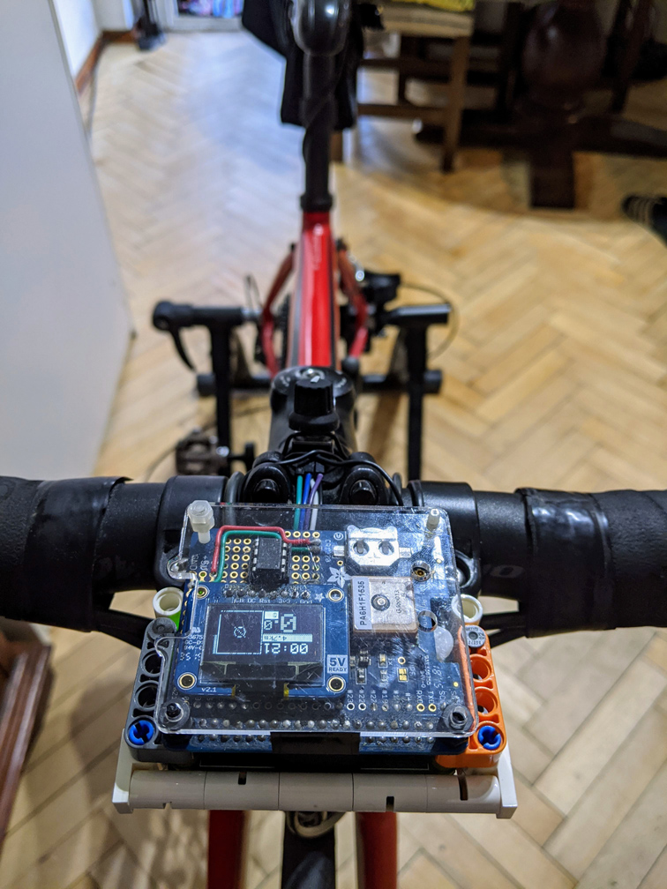
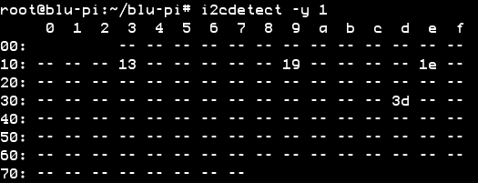

# BLU-PI CYCLING COMPUTER

GPS Cycling Computer |  Raspberry Pi + GPS + ATTiny Odometer | Node.JS

| Overview | Intervals | Sys. Averages | Map | Menu | 
| -------- | --------- | ------------- | --- | ---- | 
|  |  |  |  |  |

| Setup | Cockpit | Prototype |
| ----- | ------- | --------- |
|  |  |  |


## Install & Running

Install dependencies:

$ `npm i`

Running:

$ `node app`

Start on background (under screen):

$ `./start_and_watch_for_cycle.sh`

Install as service on Pi:

```sh
sudo cp blu-pi.service /etc/systemd/system/blu-pi.service
sudo systemctl enable blu-pi.service
sudo systemctl start blu-pi.service
```

## Usage

- **Rotating (the Rotary Encoder)** provides input within the current screen
- **Push button** to trigger an action within screen
- **Press Push button + rotate Encoder** to change displays:
  - **Overview**: Session elapsed time, distance, current speed and cadence.
  - **Averages**: Display Speed/Cadence and CPU/Temperature/RAM (on different scales)
  - **Intervals**: Lap times, using GPS anchor or by distance
  - **Map**: Plot of GPS points
  - **Off**: Minimal display
  - **IP**: Display device IP(s)
  - **Menu** (see [menu.js](./app/menu.js))
    - Dim display
    - New session
    - Reset wifi
    - Reset pi
    - Turn OFF

### Web Display

Open `http://[PI-IP-ADDRESS]:8080/` for a mirror of the display.

Use `ASD` keys to mimic Rotary Encoder. Use long press `A` and `D` to switch screens.


## Hardware

### Wiring

- 3xGPIOs for input + 2 GNDs
  - rotary.pinA = pi:16
  - rotary.pinB = pi:26
  - rotary.push = pi:21
- using i2c + vi + GND
  - attiny odometer (see [more details](./attiny_brain/READNE.md))
    - odometer.pin = attiny:pin1
    - odometer.ground = (any) ground pin
  - oled display
  - lsm303 (currently not in use - should be used to normalize GPS path along with other enhancements)
  
  

### Parts

- pi a+ (or zero)
- wifi dongle (or zero+w)
- adafruit's gps hat
  - or gps module + permaboard for wiring (5cm~ x 8cm~))
- oled 128x64 (configured with i2c)
- input: rotary encoder + push button
- cadence:
  - lblue(tooth) cadence or speed meter
- odometer-attiny:
  - ATTiny 85
  - running software:
    - as i2c slave - // TODO: link to reference
    - odometer software - // TODO: describe output!

## CREDITS

### Libraries

> (See [package.json](package.json) for all depedencies)

Adafruit GFX port to JavaScript ([display/adafruit-gfx](app/display/adafruit-gfx/index.js))
> https://communities.intel.com/message/237095#237095

Distance (using GPS):
> https://github.com/Maciek416/gps-distance

GPX parsing:
> https://www.npmjs.com/package/gpx-parse

BLE Sensor reading (sources):
> https://github.com/amcolash/BikeVR/blob/master/public/js/bluetooth.js
> https://github.com/amcolash/oled-bike-computer/blob/master/bluetooth.js
> https://github.com/kdevware-andre/kdevware-andre.github.io/blob/master/bluetooth.js

### References

ATTiny Flashing:
> https://www.instructables.com/id/Programming-the-ATtiny85-from-Raspberry-Pi/

Map lat/long to pixel:
> http://stackoverflow.com/questions/8898120/conversion-of-lat-lng-coordinates-to-pixels-on-a-given-map-with-javascript

Kalman filter:
> https://wouterbulten.nl/blog/tech/lightweight-javascript-library-for-noise-filtering/
> https://hackaday.com/2019/05/14/the-kalman-filter-exposed/
